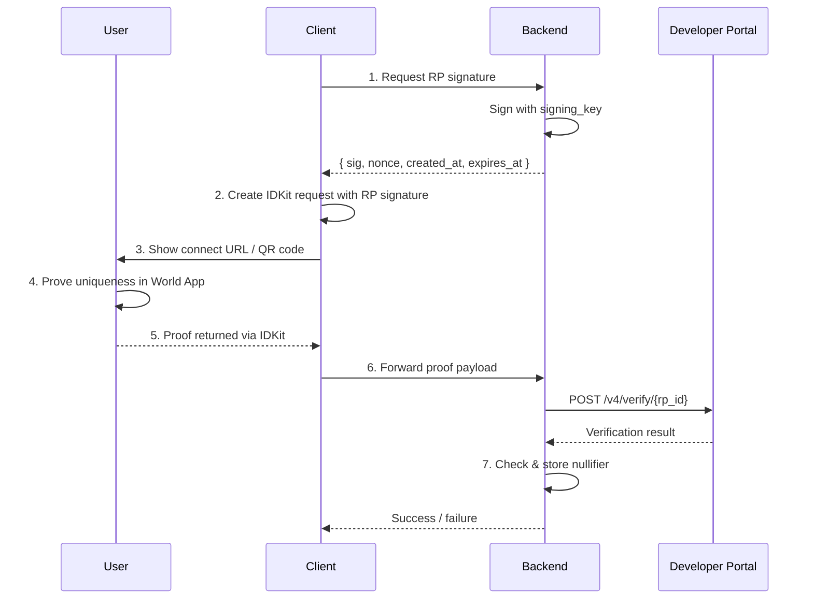

> ## Documentation Index
> Fetch the complete documentation index at: https://docs.world.org/llms.txt
> Use this file to discover all available pages before exploring further.

# Integrate

IDKit is our solution for integrating World ID. You can use the React SDK for a pre-built widget or the JS and mobile SDKs for a custom integration.

To familiarize yourself with the core concepts of World ID, check out this [page](/world-id/concepts).

# Step 1: Install IDKit

Make sure you're using the latest `4.x` version.

<CodeGroup title="Install">
  ```bash title="JavaScript" theme={null}
  npm i @worldcoin/idkit-core
  ```

  ```bash title="React" theme={null}
  npm i @worldcoin/idkit
  ```

  ```swift title="Swift (SPM)" theme={null}
  .package(url: "https://github.com/worldcoin/idkit-swift.git", from: "<version>")
  ```

  ```kotlin title="Kotlin (Gradle)" theme={null}
  dependencies {
      implementation("com.worldcoin:idkit:<version>")
  }
  ```
</CodeGroup>

# Step 2: Create an app in the Developer Portal

Create your app in the [Developer Portal](https://developer.world.org). If you're migrating from an old app you have to go through RP registration by clicking the Enable World ID 4.0 banner. Keep these values:

* `app_id`
* `rp_id`
* `signing_key` - this should be stored as a secret.

# Step 3: Generate an RP signature in your backend

Signatures verify that proof requests genuinely come from your app, preventing attackers from performing impersonation attacks.

<CodeGroup title="Generate RP signature">
  ```typescript title="JavaScript" theme={null}
  import { NextResponse } from "next/server";
  import { signRequest } from "@worldcoin/idkit-core/signing";

  export async function POST(request: Request): Promise<Response> {
    const { action } = await request.json();

    const { sig, nonce, createdAt, expiresAt } = signRequest({
      signingKeyHex: process.env.RP_SIGNING_KEY!,
      action,
    });

    return NextResponse.json({
      sig,
      nonce,
      created_at: createdAt,
      expires_at: expiresAt,
    });
  }
  ```

  ```go title="Go" theme={null}
  package main

  import (
  	"encoding/json"
  	"net/http"
  	"os"

  	"github.com/worldcoin/idkit/go/idkit"
  )

  func handleRPSignature(w http.ResponseWriter, r *http.Request) {
  	if r.Method != http.MethodPost {
  		http.Error(w, "method not allowed", http.StatusMethodNotAllowed)
  		return
  	}

  	var body struct {
  		Action string `json:"action"`
  	}
  	_ = json.NewDecoder(r.Body).Decode(&body)

  	sig, err := idkit.SignRequest(
  		os.Getenv("RP_SIGNING_KEY"),
  		idkit.WithAction(body.Action),
  	)
  	if err != nil {
  		http.Error(w, err.Error(), http.StatusInternalServerError)
  		return
  	}

  	w.Header().Set("content-type", "application/json")
  	_ = json.NewEncoder(w).Encode(map[string]any{
  		"sig":        sig.Sig,
  		"nonce":      sig.Nonce,
  		"created_at": sig.CreatedAt,
  		"expires_at": sig.ExpiresAt,
  	})
  }
  ```
</CodeGroup>

<Warning>
  Never generate RP signatures on the client and never expose your RP signing
  key. If the key leaks, attackers can forge requests from your app.
</Warning>

# Step 4: Generate the connect URL and collect proof

You can test during development using the [simulator](https://simulator.worldcoin.org/) and setting `environment` to `"staging"`.

<CodeGroup title="Create request and collect proof">
  ```typescript title="JavaScript" theme={null}
  import { IDKit, orbLegacy } from "@worldcoin/idkit-core";

  const rpSig = await fetch("/api/rp-signature", {
    method: "POST",
    headers: { "content-type": "application/json" },
    body: JSON.stringify({ action: "my-action" }),
  }).then((r) => r.json());

  const request = await IDKit.request({
    // App ID: `app_id` from the Developer Portal
    app_id: "app_xxxxx",
    // Action: Context that scopes what the user is proving uniqueness for
    // e.g., "verify-account-2026" or "claim-airdrop-2026".
    action: "my-action",
    rp_context: {
      rp_id: "rp_xxxxx", // Your app's `rp_id` from the Developer Portal
      nonce: rpSig.nonce,
      created_at: rpSig.created_at,
      expires_at: rpSig.expires_at,
      signature: rpSig.sig,
    },
    allow_legacy_proofs: true,
    environment: "production", // Only set this to staging for testing with the simulator
    return_to: "myapp://verify-done", // Optional: mobile deep-link callback URL
    // Signal (optional): Bind specific context into the requested proof.
    // Examples: user ID, wallet address. Your backend should enforce the same value.
  }).preset(orbLegacy({ signal: "local-election-1" }));

  const connectUrl = request.connectorURI;
  const response = await request.pollUntilCompletion();
  ```

  ```tsx title="React" theme={null}
  import {
    IDKitRequestWidget,
    orbLegacy,
    type RpContext,
  } from "@worldcoin/idkit";

  const rpSig = await fetch("/api/rp-signature", {
    method: "POST",
    headers: { "content-type": "application/json" },
    body: JSON.stringify({ action: "my-action" }),
  }).then((r) => r.json());

  const rp_context: RpContext = {
    rp_id: "rp_xxxxx", // Your app's `rp_id` from the Developer Portal
    nonce: rpSig.nonce,
    created_at: rpSig.created_at,
    expires_at: rpSig.expires_at,
    signature: rpSig.sig,
  };

  // ...
   
  <IDKitRequestWidget
    open={open}
    onOpenChange={setOpen}
    app_id="app_xxxxx" // Your app's `app_id` from the Developer Portal
    // Action: Context that scopes what the user is proving uniqueness for
    // e.g., "verify-account-2026" or "claim-airdrop-2026".
    action="my-action"
    rp_context={rp_context}
    allow_legacy_proofs={true}
    // Signal (optional): Bind specific context into the requested proof.
    // Examples: user ID, wallet address. Your backend should enforce the same value.
    preset={orbLegacy({ signal: "local-election-1" })}
    handleVerify={async (result) => {
      const response = await fetch("/api/verify-proof", {
        method: "POST",
        headers: { "content-type": "application/json" },
        body: JSON.stringify({
          rp_id: rp_context.rp_id,
          idkitResponse: result,
        }),
      });

      if (!response.ok) {
        throw new Error("Backend verification failed");
      }
    }}
    onSuccess={(result) => {
      // Runs after `handleVerify` succeeds. Update app state/UI here.
    }}
  />;
  ```

  ```swift title="Swift" theme={null}
  import IDKit

  // Fetch the RP signature from your backend
  let rpSig = try await yourBackend.fetchRpSignature(action: "my-action")

  let rpContext = try RpContext(
    rpId: "rp_xxxxx", // Your app's `rp_id` from the Developer Portal
    nonce: rpSig.nonce,
    createdAt: rpSig.createdAt,
    expiresAt: rpSig.expiresAt,
    signature: rpSig.sig
  )

  let config = IDKitRequestConfig(
    // App ID: `app_id` from the Developer Portal
    appId: "app_xxxxx", 
    // Action: Context that scopes what the user is proving uniqueness for
    // e.g., "verify-account-2026" or "claim-airdrop-2026".
    action: "my-action",
    rpContext: rpContext,
    actionDescription: "Verify user",
    bridgeUrl: nil,
    allowLegacyProofs: true,
    overrideConnectBaseUrl: nil,
    environment: .production
  )

  // Signal (optional): Bind specific context into the requested proof.
  // Examples: user ID, wallet address. Your backend should enforce the same value.
  let request = try IDKit.request(config: config).preset(orbLegacy(signal: "local-election-1"))
  let connectUrl = request.connectorURL
  let completion = await request.pollUntilCompletion()
  ```

  ```kotlin title="Kotlin" theme={null}
  import com.worldcoin.idkit.IDKit
  import com.worldcoin.idkit.IDKitRequestConfig
  import com.worldcoin.idkit.RpContext
  import com.worldcoin.idkit.Environment
  import com.worldcoin.idkit.orbLegacy

  // Fetch the RP signature from your backend (see Step 2)
  val rpSig = yourBackend.fetchRpSignature(action = "my-action")

  val rpContext = RpContext(
    rpId = "rp_xxxxx", // Your app's `rp_id` from the Developer Portal
    nonce = rpSig.nonce,
    createdAt = rpSig.createdAt.toULong(),
    expiresAt = rpSig.expiresAt.toULong(),
    signature = rpSig.sig,
  )

  val config = IDKitRequestConfig(
    // App ID: `app_id` from the Developer Portal
    appId = "app_xxxxx", 
    // Action: Context that scopes what the user is proving uniqueness for
    // e.g., "verify-account-2026" or "claim-airdrop-2026".
    action = "my-action",
    rpContext = rpContext,
    allowLegacyProofs = true,
  )

  // Signal (optional): Bind specific context into the requested proof.
  // Examples: user ID, wallet address. Your backend should enforce the same value.
  val request = IDKit.request(config).preset(orbLegacy(signal = "local-election-1"))
  val connectorURI = request.connectorURI
  val completion = request.pollUntilCompletion()
  ```
</CodeGroup>

### IDKit response

After the user completes the verification flow, IDKit returns one of the following response shapes depending on the protocol version and proof type.

<CodeGroup title="IDKit response">
  ```json title="World ID 3.0 (Legacy)" theme={null}
  {
    "protocol_version": "3.0",
    "nonce": "a1b2c3d4-e5f6-7890-abcd-ef1234567890",
    "action": "my-action",
    "environment": "production",
    "responses": [
      {
        "identifier": "orb",
        "signal_hash": "0x00c5d2460186f7233c927e7db2dcc703c0e500b653ca82273b7bfad8045d85a4",
        "proof": "0x1a2b3c...encoded_proof",
        "merkle_root": "0x0abc123...root_hash",
        "nullifier": "0x04e5f6...nullifier_hash"
      }
    ]
  }
  ```

  ```json title="World ID 4.0 Uniqueness" theme={null}
  {
    "protocol_version": "4.0",
    "nonce": "a1b2c3d4-e5f6-7890-abcd-ef1234567890",
    "action": "my-action",
    "environment": "production",
    "responses": [
      {
        "identifier": "orb",
        "signal_hash": "0x0",
        "proof": ["0x1a2b...", "0x3c4d...", "0x5e6f...", "0x7a8b...", "0x9c0d..."],
        "nullifier": "0x04e5f6...rp_scoped_nullifier",
        "issuer_schema_id": 1,
        "expires_at_min": 1756166400
      }
    ]
  }
  ```

  ```json title="World ID 4.0 Session" theme={null}
  {
    "protocol_version": "4.0",
    "nonce": "a1b2c3d4-e5f6-7890-abcd-ef1234567890",
    "session_id": "ses_abc123",
    "environment": "production",
    "responses": [
      {
        "identifier": "orb",
        "signal_hash": "0x0",
        "proof": ["0x1a2b...", "0x3c4d...", "0x5e6f...", "0x7a8b...", "0x9c0d..."],
        "session_nullifier": ["0x04e5f6...session_nullifier", "0x07a8b9...generated_action"],
        "issuer_schema_id": 1,
        "expires_at_min": 1756166400
      }
    ]
  }
  ```
</CodeGroup>

# Step 5: Verify the proof in your backend

After successful completion, send the returned payload to your backend and
forward it directly to: `POST https://developer.world.org/api/v4/verify/{rp_id}`

<Note>
  Forward the IDKit result payload as-is. No field remapping is required.
</Note>

```typescript title="app/api/verify-proof/route.ts" theme={null}
import { NextResponse } from "next/server";
import type { IDKitResult } from "@worldcoin/idkit";

export async function POST(request: Request): Promise<Response> {
  const { rp_id, idkitResponse } = (await request.json()) as {
    rp_id: string;
    idkitResponse: IDKitResult;
  };

  const response = await fetch(
    `https://developer.world.org/api/v4/verify/${rp_id}`,
    {
      method: "POST",
      headers: { "content-type": "application/json" },
      body: JSON.stringify(idkitResponse),
    },
  );

  if (!response.ok) {
    return NextResponse.json({ error: "Verification failed" }, { status: 400 });
  }

  // Proof is valid — now store the nullifier (see Step 6)
  return NextResponse.json({ success: true });
}
```

# Step 6: Store the nullifier

Every World ID proof contains a nullifier — a value derived from the user's World ID, your app, and the action. The same person verifying the same action always produces the same nullifier, but different apps or actions produce different ones — making nullifiers unlinkable across apps.

The Developer Portal confirms the proof is **cryptographically valid**, but your backend must check that the nullifier hasn't been used before. Without this, the same person could verify multiple times for the same action.

Nullifiers are returned as 0x-prefixed hex strings representing 256-bit integers. We recommend converting and storing them as numbers to avoid parsing and casing issues that can lead to security vulnerabilities. For example, PostgreSQL doesn't natively support 256-bit integers, instead you can convert to the nullifier to a decimal and store it as `NUMERIC(78, 0)`.

<CodeGroup>
  ```sql title="PostgreSQL schema" theme={null}
  CREATE TABLE nullifiers (
    nullifier   NUMERIC(78, 0) NOT NULL,
    action      TEXT NOT NULL,
    verified_at TIMESTAMPTZ NOT NULL DEFAULT NOW(),
    UNIQUE (nullifier, action)
  );
  ```
</CodeGroup>

## Architecture overview



## Next pages

* [RP Signatures](/world-id/idkit/signatures) — algorithm details, pseudocode, and test vectors
* [POST /v4/verify reference](/api-reference/developer-portal/verify)
